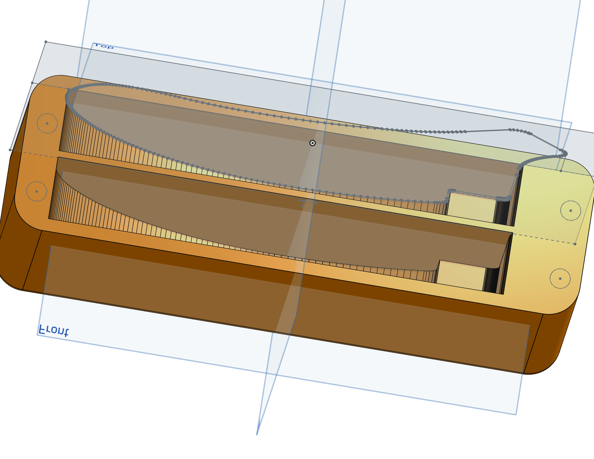

# 3D printed travel case for the Brain

The travel case is designed in two parts and are connected with print in place magnets.

## Preview

| Closed | Open |
| --- | ---  |
|  |  |

## Design

The design is split into two parts and are connected with print-in-place magnets. Meaning that the print is paused at a certain height and the magnets are inserted into the print. The print is then resumed and the magnets are encased in the print. The magnets used are 6x3mm neodymium magnets.

[Onshape design](https://cad.onshape.com/documents/ca702f1514417f775ac77674/w/a5f5f447b02d600e7c1a381b/e/59998fea22245e9ac184edc3?renderMode=0&uiState=6429dd2270aad826e190cf0d)

## Printing

Printed in PLA with 0.2mm layer height and 20% infill. No supports are needed.

At layer 18 (3.6mm) the print is paused and the magnets are inserted into the print. The print is then resumed and the magnets are encased in the print.

Print placement.

