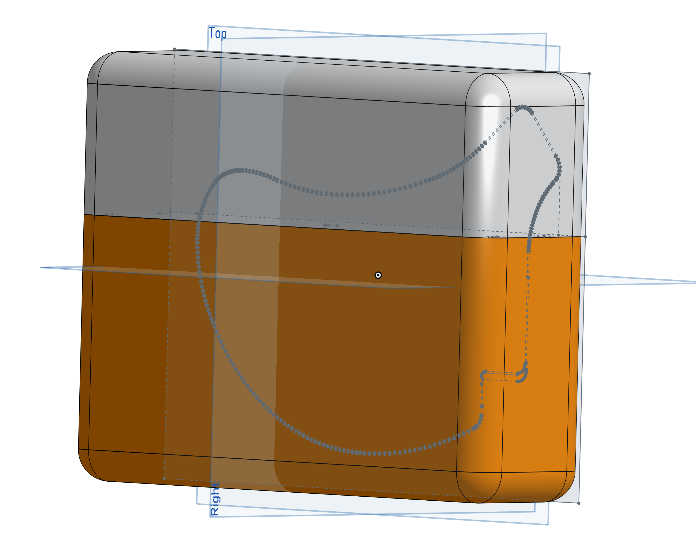

# 3D printed travel case for the Brain

> **Warning**
> This design is not tested with the nice!view since those has been hard to come by lately. When I get some nice!views I will add a design which works 100% with those. 😊

The travel case is designed in two parts and are connected with print in place magnets. The inside is designed to fit the Brain with the [3d printed case](../case/README.md). The lid snaps into place in an utterly satisfying way.

## Preview

| Closed | Open |
| --- | ---  |
|  |  |

## Design

The design is split into two parts and are connected with print-in-place magnets. Meaning that the print is paused at a certain height and the magnets are inserted into the print. The print is then resumed and the magnets are encased in the print. The magnets used are 6x3mm neodymium magnets.

[Onshape design](https://cad.onshape.com/documents/a8c7393d87d948afba2c6e43/w/ea731c1d3c5cb85e11790472/e/4dde8ed377b236e8ab6f5f7d?renderMode=0&uiState=648cb0194527e13c17574a58)

## Printing

Printed in PLA with 0.2mm layer height and 20% infill. No supports are needed.

At layer 18 (3.6mm) the print is paused and the magnets are inserted into the print. The print is then resumed and the magnets are encased in the print.

Print placement.

