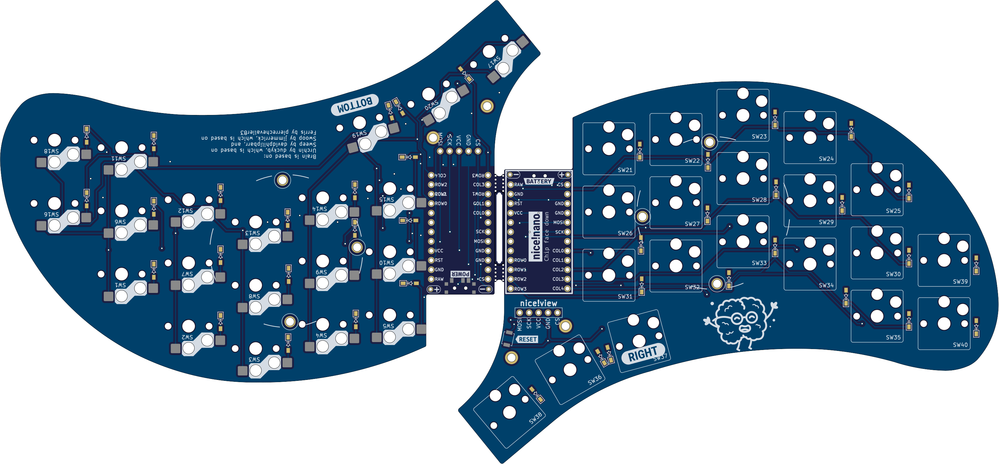

# Brain (based on [Urchin by Duckyb](https://github.com/duckyb/urchin))

TODO
Prio 1
- Check that everything is connected.
- Reorder labels.
- Add standoff mounting holes for acrylic or 3d printed nice!view cover, can we use same mounting pattern Cornes oled acrylic cover? Nice!view is 10.5mm high from pcb top side.
Prio 2
- Remove top pads and unused tracks.
- Make new tracks nicer.
- Bring pad which is outside edge cut in by extending edge cut, do the same on other board

  
  
  

TODO: Add text on why this exists.

**This is a strictly wireless-only design, and is only compatible with ZMK / nice!nano. Only Choc v1 switches + Hotswap are supported!**

**If you enjoy my work, please consider ⭐ starring and/or ❤ sponsoring it.**

## Features compared to [Urchin](https://github.com/duckyb/urchin)

- [x] Original pinky column lowered 2mm.
- [x] A new pinky column added with two buttons, also 2mm offset down from its neighbour.
- [x] One new thumb button added.
- [ ] Add 3D printed case.
- [ ] Add travel case.

## Part list (for both sides)
#### Required
TODO: Update
- 1× PCB Kit (files for it are in [releases](https://github.com/duckyb/urchin/releases))
- 34× Kailh **CHOC** Hotswap Sockets
- 34× Kailh Choc v1 Switches
- 34× Keycaps
- 34× SMD diodes (SOD-123)
- 2× nice!nano
- 2× Lipo battery (301230)
- 48× mill-max machined pins
- 2× Pair of female mill-max headers (raised ones to fit battery, https://www.digikey.se/sv/products/detail/mill-max-manufacturing-corp/310-43-112-41-001000/1212186)
#### Optional
- 2× nice!view (needs higher sockets to get level above raised mill-max sockets, TODO add exact ones)
- 2× Reset switch (B3U-1000P(M))
- 2× Power switch (MSK 12C02)
- 10× adhesive silicone feet

## How do I make this?

TODO: Update

## Firmware

TODO: Update

Urchin supports ZMK only. To get started with ZMK visit the [zmk-urchin repository](https://github.com/duckyb/zmk-urchin) and follow the provided instructions.

## Credits

TODO: Update

- PCB edge design by [jimmerricks](https://github.com/jimmerricks/swoop)
- Coral, rocks, sand & bubbles by [Kneecrust](https://linktr.ee/kneecrust)
- The development name "Swipe Light" by [Pete](https://github.com/petejohanson)
- Nice!view integration reference: [sadekbaroudi/sweep36](https://github.com/sadekbaroudi/sweep36)
- ZMK Firmware help by [Mabroum](https://github.com/AlaaSaadAbdo) & [Bravekarma](https://github.com/caksoylar)
- Silkscreen labels style: [bastardkb/dilemma](https://github.com/Bastardkb/Dilemma)
- 3d case by [iamDrakkir](https://github.com/iamDrakkir)
- 3d case by [chewiedies](https://www.printables.com/it/social/360738-chewiedies/about)
