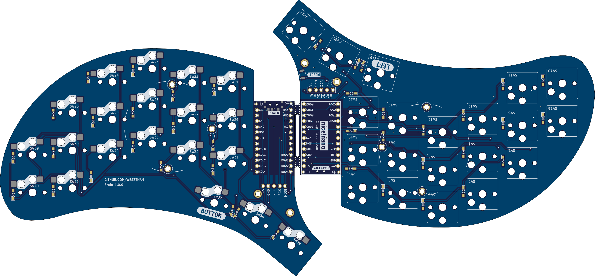

# Brain (based on [Urchin by Duckyb](https://github.com/duckyb/urchin))

  
  
  
  

My first ever keyboard build was the Ferris Sweep, it's a wonderful keyboard! But I missed a few keys, the ctrl and shift keys on the left side and since I'm Swedish, I also wanted keys for åäö. Apart from this I was also only interested in wireless designs and was not interested in the TRRS jacks etc. The Urchin was the perfect solution for me, but I were still missing those oh so sought after keys. So I decided to make my own version of the Urchin, with a few extra keys and a little tweek to the edge cut to fit them nicely.

The result of this is the Brain, a wireless split keyboard based on the Urchin with 3 extra keys on each side. One extra pinky column with two keys and one extra thumb key. All 5 pinky keys are placed 2mm lower than the original Urchin keys, to make it easier to reach them.

**This is a strictly wireless-only design, and is only compatible with ZMK / nice!nano. Only Choc v1 switches + Hotswap are supported!**

## Features compared to [Urchin](https://github.com/duckyb/urchin)

- [x] Original pinky column lowered 2mm.
- [x] A new pinky column added with two buttons, also 2mm offset down from its neighbour.
- [x] One new thumb button added.
- [x] Holes that fit [Corne Acrylic cover](https://kriscables.com/product/corne-oled-cover-plate/) for nice!view.

## Feature requests for 2.0

- [ ] Raise last pinky column, maybe as much as 7-8 mm. For easier access to both the keys and not only the top one.
- [ ] Add back the fourth hole for tenting puck.
- [ ] Rotate the diode for switch 17, it's reversed now which causes confusion.
- [ ] Change the reset switch B3U-1000P(M) to regular tactile reset switch such as https://kriscables.com/product/tactile-reset-switch/ since it's a pain to get hold of the original reset switch.
- [ ] Do a non battery RGB blingbling version? I almost only use my keyboard without battery and a cable like this anyway https://www.amazon.se/dp/B0CYT426GZ?ref=ppx_yo2ov_dt_b_fed_asin_title&th=1

## Part list (for both sides)

#### Required

- 1× PCB Kit (files for it are in [releases](https://github.com/wesztman/brain/releases))
- 40× Kailh **CHOC** Hotswap Sockets (https://splitkb.com/products/kailh-hotswap-sockets?variant=39472161456205)
- 40× Kailh Choc v1 Switches (https://splitkb.com/collections/switches-and-keycaps/products/kailh-low-profile-choc-switches)
- 40× Keycaps 1u (https://splitkb.com/collections/switches-and-keycaps/products/blank-mbk-choc-low-profile-keycaps)
- 40× SMD diodes (SOD-123) (https://splitkb.com/products/smd-diodes?_pos=1&_sid=3cfc3a302&_ss=r)
- 2× nice!nano (https://splitkb.com/products/nice-nano?_pos=1&_sid=0e4cc26b1&_ss=r)
- 2× Lipo battery (301230) (https://kriscables.com/product/li-po-battery-3-7v-110mah/)
- 48× mill-max machined pins (https://kriscables.com/product/mill-max-socket-pins/)
- 2× Pair of female mill-max headers (raised ones to fit battery) (https://kriscables.com/product/mill-max-low-profile-sockets/)

#### Optional

- 2× nice!view (needs higher sockets to get level above raised mill-max sockets, TODO add exact ones) (https://splitkb.com/collections/keyboard-parts/products/nice-view)
- 2× Reset switch (B3U-1000P(M)) (https://www.digikey.se/sv/products/detail/omron-electronics-inc-emc-div/B3U-1000P/1534338?srsltid=AfmBOop7zspfRjYOQ7LR1wDdW5W1PJkAlY6OWJ5YXfqCBF3_GB-U63jH)
- 2× Power switch (MSK 12C02) (https://kriscables.com/product/msk-12c02-power-switch/)
- 16× adhesive silicone feet 8mm (https://www.amazon.se/-/en/Adhesive-Silicone-Semicircle-Transparent-Furniture/dp/B09QSKVBL5)

## How do I make this?

Follow the the excellent build guide in the link below. The only difference is the 3 extra keys on each side.

Note that diodes should only be mounted on the "BOTTOM" side of the PCBs.

## Firmware

Brain supports ZMK only.

Firmware is provided by the lovely [iamDrakkir](https://github.com/iamDrakkir) and can be found in his [zmk-brain](https://github.com/iamDrakkir/zmk-brain) repo.

My personal fork can be found [here](https://github.com/Wesztman/zmk-config?organization=Wesztman&organization=Wesztman) if it's of interest for anyone.

## 3D Printed Cases

| Top | Side |
| --- | ---  |
|  |  |

| Closed | Open |
| --- | ---  |
|  |  |

## Credits

- Urchin by [duckyb](https://github.com/duckyb/urchin)
- Logo by [Ariyanto Deni](https://thenounproject.com/ariyantodeni/)
- 3D case by [iamDrakkir](https://github.com/iamDrakkir)
- ZMK Firmware [iamDrakkir](https://github.com/iamDrakkir)

## Featured In

- [KBD Issue #122](https://kbd.news/Brain-2014.html)

## License
[MIT](https://github.com/Wesztman/brain/blob/main/LICENSE)

<a href="https://star-history.com/#Wesztman/brain&Date">
 <picture>
   <source media="(prefers-color-scheme: dark)" srcset="https://api.star-history.com/svg?repos=Wesztman/brain&type=Date&theme=dark" />
   <source media="(prefers-color-scheme: light)" srcset="https://api.star-history.com/svg?repos=Wesztman/brain&type=Date" />
   
 </picture>
</a>

